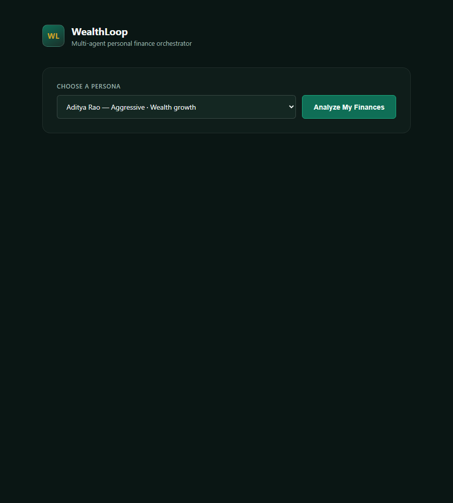
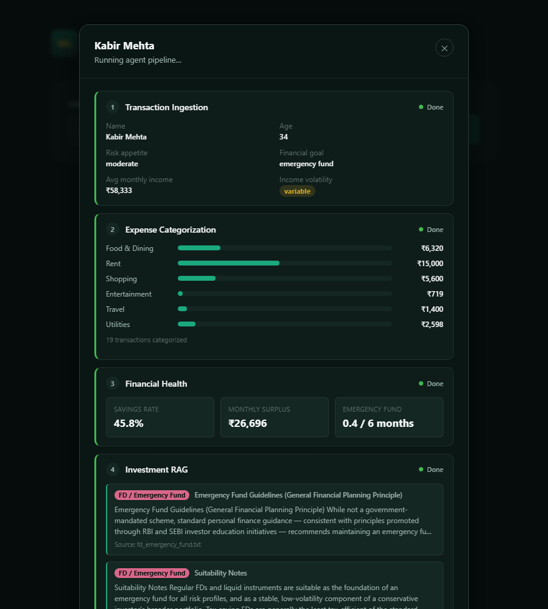
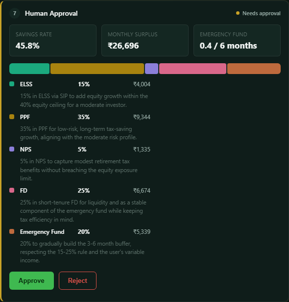
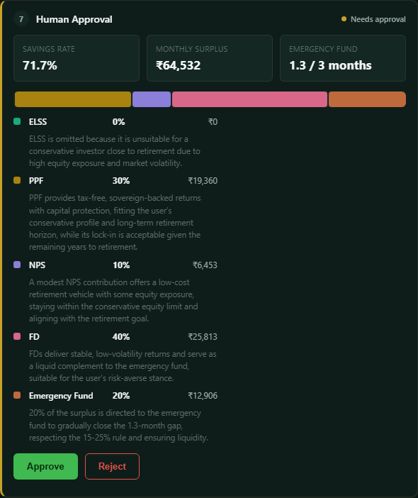

# WealthLoop

A multi-agent personal finance orchestrator that turns a user's raw transactions into a compliance-checked, human-approved investment plan — built with Python, LangGraph, LangChain, ChromaDB, and Groq (`openai/gpt-oss-120b`).

## Problem statement

Most "robo-advisor" demos either hardcode a recommendation or let an LLM freewheel straight to output with no guardrails. WealthLoop instead runs the recommendation through a deterministic suitability check before a human ever sees it, and puts a real human-in-the-loop approval gate between the AI's proposal and any "execution" — with a genuine retry loop when either the compliance rules or the human reject the plan.

## Screenshots

| | |
|---|---|
|  |  |
| Persona picker | Pipeline mid-run: ingestion, categorization, financial health, RAG citations |
|  |  |
| Human approval gate with the proposed allocation | Sunita's plan — ELSS excluded (0%) with the reasoning shown inline |

## Architecture: the 8-agent LangGraph pipeline

```
START → ingestion → categorization → health_assessment → rag_retrieval → recommendation → compliance_guardrail
                                                                                 ↑                    │
                                                                                 └────(fail)───────────┤
                                                                                                        ↓(pass)
                                                                                                 approval_gate
                                                                                 ┌──────(rejected)──────┤
                                                                                 ↓                       ↓(approved)
                                                                          recommendation              execution → END
```

| # | Agent | What it does | LLM? |
|---|---|---|---|
| 1 | **Ingestion** | Normalizes raw `user_profile` — computes `average_monthly_income` (mean if income is a list, e.g. a freelancer's variable months) and `income_volatility` ("stable"/"variable" from the swing between months) | No — pure calculation |
| 2 | **Categorization** | Validates/corrects the mock transactions' rough categories against a fixed 6-category set | Yes — single validation pass, strict JSON, fence-stripping + retry on rate limits |
| 3 | **Health Assessment** | Computes `savings_rate`, `surplus_amount`, and `emergency_fund_status` (e.g. "0.4 / 6 months") | No — pure calculation |
| 4 | **Investment RAG** | Builds a query from `risk_appetite` + `financial_goal` + `income_volatility`, retrieves top-k chunks from ChromaDB (4 scheme documents: NPS, PPF, ELSS, FD/Emergency Fund) | No — pure retrieval (`sentence-transformers/all-MiniLM-L6-v2`) |
| 5 | **Recommendation** | Proposes a % allocation across ELSS/PPF/NPS/FD/Emergency Fund, explicitly instructed to judge each retrieved chunk's suitability language itself rather than trust retrieval rank; incorporates prior rejection/compliance feedback on retries | Yes — the core reasoning agent |
| 6 | **Compliance Guardrail** | Deterministic, auditable rule check (e.g. moderate risk → ELSS+NPS ≤ 40% of surplus); on failure, one LLM call generates a human-readable explanation citing the actual numbers | Rules: no. Explanation text: yes |
| 7 | **Human Approval** | Pauses the graph via LangGraph's `interrupt()` and waits — indefinitely, no timeout — for Approve or Reject (+ a fixed-choice reason) | No |
| 8 | **Execution** | Only runs if approved; computes `monthly_sip`, `annual_deployment`, and a rough estimated tax saved (Section 80C + 80CCD(1B), capped at real limits) | No — pure calculation |

**The two loops are real, not decorative:**
- `compliance_guardrail → recommendation`: capped at 2 automatic retries (`revision_round`) before forcing the plan to a human regardless.
- `approval_gate → recommendation`: a human rejection (with a reason from a fixed set: "Too aggressive" / "Want more liquidity" / "Other") sends the plan back for a fresh attempt, carrying that reason in the prompt.

State persists via LangGraph's `MemorySaver` checkpointer, keyed by a `thread_id` = the session's UUID, so multiple analyses can run independently.

## Tech stack

- **Orchestration:** LangGraph (`StateGraph`, conditional edges, `interrupt()`, `MemorySaver`)
- **LLM:** Groq (`openai/gpt-oss-120b`) via `langchain-groq`
- **RAG:** ChromaDB (persistent, local) + `sentence-transformers` (`all-MiniLM-L6-v2`)
- **Backend:** FastAPI, Server-Sent Events (`sse-starlette`) for live pipeline streaming
- **Frontend:** vanilla HTML/CSS/JS (no framework) — an SSE client that animates 8 agent cards through pending → running → done
- **Config:** `python-dotenv`, Pydantic

## Setup & run

```bash
# 1. Install dependencies
pip install -r requirements.txt

# 2. Configure environment
cp .env.example .env
# then edit .env and set GROQ_API_KEY

# 3. Ingest the RAG scheme documents into ChromaDB (run once, or after editing
#    the .txt files in backend/rag/documents/)
python -m backend.rag.ingest

# 4. Start the server
uvicorn backend.main:app --reload

# 5. Open the app
# http://127.0.0.1:8000
```

Optional: set `DEMO_FORCE_FAIL_FOR` in `.env` (e.g. `DEMO_FORCE_FAIL_FOR=kabir`) to guarantee the compliance fail-then-retry loop fires on that persona's first attempt during a live demo — it forces the failure flag only, the underlying rule logic is untouched. Leave it blank for organic behavior.

## What's real vs. what's mocked

**Mocked (illustrative, for demo purposes):**
- The 3 personas (`backend/mock_data/personas.py`) and their transaction histories (`backend/mock_data/transactions.py`) are hand-authored sample data, not real bank feeds.

**Fully functional (not mocked):**
- **RAG retrieval** — real embeddings, real ChromaDB vector search over real (if illustrative) scheme documents.
- **LLM reasoning** — every categorization, recommendation, and compliance-explanation call is a real Groq API call; nothing is templated or canned.
- **Compliance logic** — the suitability rules are real, deterministic, and auditable (not LLM-decided), and genuinely alter the graph's execution path.
- **The LangGraph state machine** — the conditional loops, the `interrupt()`-based human-in-the-loop pause, and the checkpointer are all real; nothing about the control flow is simulated on the frontend. The UI's "running" state per card is a deliberate perceived-pacing animation (since real backend events can arrive faster than is legible), but every event it renders came from an actual node execution.

## Demonstrated capabilities

**Organic compliance-fail-then-retry (Kabir).** Running Kabir Mehta (moderate risk, emergency-fund goal) end-to-end repeatedly showed the recommendation agent naturally proposing ELSS+NPS combinations that exceed the 40% moderate-risk cap (e.g. 30%+15%=45%) on a real, un-forced run — `compliance_guardrail` caught it, `revision_round` incremented, and the second attempt corrected to within the cap. Confirmed both via terminal state-history inspection and live in the browser (attempt badge advancing on the Recommendation card).

**Human-reject-then-revise (works on any persona, tested on Kabir).** The `approval_gate → recommendation` loop isn't persona-specific — any plan can be rejected. Tested live: rejected Kabir's plan with "Too aggressive," confirmed the pipeline visibly looped back through recommendation → compliance → approval a second time, with the rejection reason present in the retry prompt and the recommendation agent's revised reasoning explicitly referencing it.

**RAG-driven suitability reasoning (Sunita's ELSS exclusion).** Sunita Iyer (conservative, near-retirement) retrieves ELSS's own "Suitability Notes" chunk during RAG (dense retrieval doesn't filter it out — see limitation below), but the recommendation agent correctly assigns it **0%** with reasoning that explicitly cites her age and risk profile, rather than treating "retrieved" as "recommended." This is the core test of whether the "don't assume retrieval order means suitability" instruction actually works, and it does.

**Known limitations:**
- **Dense retrieval's suitability-notes clustering.** `all-MiniLM-L6-v2` tends to rank all four scheme documents' "Suitability Notes" sections closely together, since they use similar risk/investor-profile language regardless of whether the note recommends *for* or *against* that scheme for a given user. Retrieval rank is therefore not a reliable proxy for "good match" — the recommendation agent is explicitly prompted to read each chunk's actual content rather than trust its position in the top-k results, which is why the Sunita case above works despite this.
- **Synchronous LLM calls.** All Groq calls use `langchain_groq`'s synchronous `.invoke()`, which blocks the asyncio event loop for that call's duration inside `graph.astream()`. Fine for the single-session demo as built; supporting many concurrent sessions well would need switching to `.ainvoke()`.
