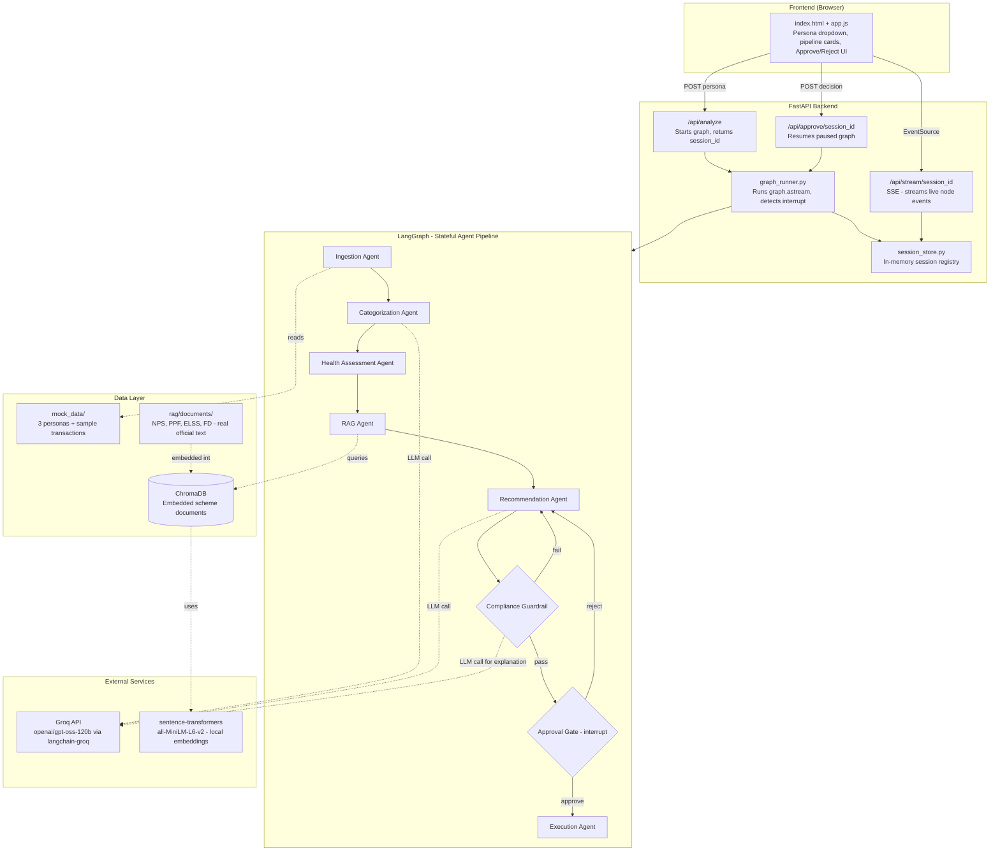
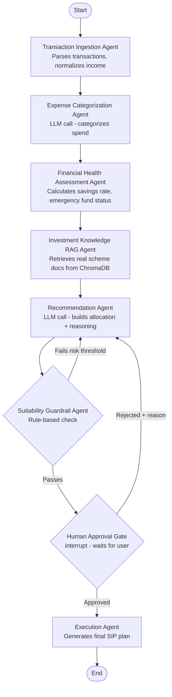

<div align="center">

# 🔁 WealthLoop

### An autonomous multi-agent personal finance orchestrator for Indian users

[](https://www.python.org/)
[](https://www.langchain.com/langgraph)
[](https://www.langchain.com/)
[](https://www.trychroma.com/)
[](https://groq.com/)
[](https://fastapi.tiangolo.com/)
[](#)

*Reads your spending → assesses financial health → retrieves real government scheme rules → drafts an investment plan → checks it against a suitability policy → waits for your approval — and corrects its own mistakes before you ever see them.*

</div>

---

## 📑 Table of Contents

- [The Problem](#-the-problem)
- [What Makes This Different](#-what-makes-this-different)
- [Architecture](#-architecture)
- [Agent Reference](#-agent-reference)
- [Tech Stack](#-tech-stack)
- [Setup & Run](#-setup--run)
- [What's Real vs. Mocked](#-whats-real-vs-mocked)
- [Demonstrated Capabilities](#-demonstrated-capabilities)
- [Known Limitations](#-known-limitations)
- [Screenshots](#-screenshots)
- [Project Structure](#-project-structure)

---

## 🎯 The Problem

Most people don't get personalized, unbiased financial planning. They either don't save systematically, or get steered toward products that don't match their actual risk profile and life stage — often because the only "advisor" they can access earns a commission on what they sell.

**WealthLoop automates the reasoning a good financial advisor does**: read the rules, match them to the person, check the suggestion against a suitability policy, and never act without sign-off — using an agentic AI pipeline instead of a human intermediary.

---

## ⚡ What Makes This Different

This isn't a single LLM call wrapped in a chat UI. It's a **stateful, cyclic multi-agent pipeline** where:

| | |
|---|---|
| 📚 **Grounded retrieval** | Investment scheme details come from real PFRDA, SEBI, and Ministry of Finance source material embedded in a vector store — not the LLM's general knowledge |
| 🛡️ **Self-correcting** | A recommendation can be rejected by an independent Suitability Guardrail on rule-based grounds, sent back for revision, and corrected automatically — before a human ever sees it |
| 🙋 **Human-in-the-loop** | A person can *also* reject an already-compliant recommendation for their own reasons — that reason feeds back into the next attempt as context |
| ✅ **Verified, not scripted** | Every loop below was observed occurring organically during testing — see [Demonstrated Capabilities](#-demonstrated-capabilities) |

---

## 🏗️ Architecture

### Full system



### Agent pipeline detail



<details>
<summary><b>Why both LangChain and LangGraph?</b> (click to expand)</summary>
<br>

**LangChain** (`langchain-groq`) is the layer that talks to the LLM — building prompts and making the actual `ChatGroq` calls to Groq's API.

**LangGraph** is the orchestration layer on top — it owns the `FinanceState`, decides which agent runs next, and implements the two conditional loops (compliance-fail-then-retry, human-reject-then-revise) along with the `interrupt()`/resume mechanism for human-in-the-loop approval. LangChain alone can make a single LLM call; it has no concept of a stateful, cyclic, pausable pipeline — that's what LangGraph adds.

</details>

---

## 🤖 Agent Reference

| # | Agent | LLM Call? | What it does |
|:-:|-------|:---:|---|
| 1 | **Transaction Ingestion** | ❌ | Loads transactions, normalizes income (handles fixed & variable income) |
| 2 | **Expense Categorization** | ✅ | Validates/refines spend categorization across 6 categories |
| 3 | **Financial Health Assessment** | ❌ | Computes savings rate, monthly surplus, emergency fund status |
| 4 | **Investment Knowledge RAG** | ❌ (retrieval only) | Queries ChromaDB for scheme details relevant to profile & goal |
| 5 | **Recommendation** | ✅ | Drafts allocation across ELSS / PPF / NPS / FD / Emergency Fund, with reasoning |
| 6 | **Suitability Guardrail** | ⚠️ (rules deterministic; explanation text is LLM-generated) | Checks allocation vs. risk-based equity caps; fails & loops back if violated |
| 7 | **Human Approval Gate** | ❌ | Pauses the pipeline via LangGraph's `interrupt()`; waits for a real decision |
| 8 | **Execution** | ❌ | Computes final monthly SIP, annual deployment, estimated tax savings |

---

## 🛠️ Tech Stack

- **Orchestration** — LangGraph (stateful graph, conditional edges, `interrupt()`/checkpointer for HITL)
- **LLM layer** — LangChain (`langchain-groq`) → Groq API, model `openai/gpt-oss-120b`
- **RAG** — ChromaDB (persisted vector store) + `sentence-transformers` (`all-MiniLM-L6-v2`, local/free embeddings)
- **Backend** — FastAPI + `sse-starlette` (Server-Sent Events for live pipeline streaming)
- **Frontend** — Vanilla HTML/CSS/JS, no build step — `EventSource` streams node-by-node progress into an animated pipeline modal

---

## 🚀 Setup & Run

```bash
# 1. Clone and enter the project
git clone https://github.com/manjesh0091/wealthloop.git
cd wealthloop

# 2. Create and activate a virtual environment
python -m venv venv
venv\Scripts\Activate.ps1        # Windows PowerShell
# source venv/bin/activate       # macOS/Linux

# 3. Install dependencies
pip install -r requirements.txt

# 4. Configure environment
cp .env.example .env
# edit .env and add your GROQ_API_KEY

# 5. Embed the RAG source documents into ChromaDB (one-time)
python backend/rag/ingest.py

# 6. Run the server
python -m uvicorn backend.main:app --reload

# 7. Open http://127.0.0.1:8000
```

> **Optional flags:** `DEMO_FORCE_FAIL_FOR=<persona>` guarantees the compliance fail-then-retry loop fires on demand. The frontend's **"Step through mode"** pauses after each agent completes for manual inspection.

---

## 🔍 What's Real vs. Mocked

| Component | Status | Notes |
|---|:---:|---|
| LangGraph state machine, both conditional loops | ✅ **Real** | Tested with real interrupt/resume cycles on independent threads |
| ChromaDB retrieval | ✅ **Real** | Genuine vector search, not keyword lookup |
| RAG source documents | ✅ **Real content** | Sourced from official PFRDA / SEBI / Ministry of Finance material |
| LLM reasoning (all 3 LLM-calling agents) | ✅ **Real** | Live Groq calls, not templated outputs |
| Suitability Guardrail rules | ✅ **Real, deterministic** | Auditable rule-based thresholds, not an LLM judgment call |
| Human-in-the-loop approval | ✅ **Real** | Genuine `interrupt()` — no fixed timer, waits indefinitely |
| Sample personas & transactions | 🟡 **Illustrative** | Realistic but not connected to a real bank/UPI feed |
| Execution (SIP activation) | 🟡 **Illustrative** | Produces a final plan; not wired to a real broker/AMC |

---

## ✅ Demonstrated Capabilities

**1. Organic compliance-fail-then-retry loop** *(Kabir persona)* — The Recommendation Agent produced 45% combined equity exposure against a 40% cap for "moderate" risk. The Guardrail caught it, explained why with the actual numbers, and the next attempt corrected to 35% — observed to occur naturally, without forcing.

**2. RAG-grounded suitability reasoning** *(Sunita persona)* — Retrieved chunks included ELSS's own suitability notes warning it's unsuitable near retirement. Rather than treating retrieval as endorsement, the agent read the content and assigned ELSS 0%, citing the reasoning explicitly.

**3. Human-reject-then-revise loop** — Rejecting an already-compliant plan with a reason ("Too aggressive") correctly routed back with that context, and the next attempt addressed it directly.

**4. Goal-vs-policy tension handling** *(Kabir persona)* — When a 15–25% allocation cap directly constrained his own stated goal (emergency fund), the agent began explicitly naming the tension and resolving it via supplementary liquidity or an explicit timeline.

---

## ⚠️ Known Limitations

- Dense retrieval (`all-MiniLM-L6-v2`) doesn't reliably separate "recommended for this profile" from "warned against for this profile" at the ranking level — handled by prompting the LLM to read chunk content rather than trust rank.
- LLM calls are synchronous within the async graph loop — fine for single-session use; would need `ainvoke()` for concurrent multi-user sessions.
- Groq's free-tier daily token cap (200K TPD) was hit during testing; a lightweight response cache mitigates this for repeated demo runs.

---

## 📸 Screenshots

| Landing Page | Pipeline Mid-Run |
|:---:|:---:|
|  |  |

| Approval Gate | Suitability Reasoning (Sunita) |
|:---:|:---:|
|  |  |

---

## 📂 Project Structure

```
wealthloop/
├── backend/
│   ├── main.py, config.py, state.py, graph.py, graph_runner.py, session_store.py
│   ├── agents/          # 8 agent implementations
│   ├── rag/              # ingest.py, retriever.py, documents/ (source texts)
│   ├── mock_data/         # personas.py, transactions.py
│   └── routers/           # analyze.py, stream.py, approve.py
├── frontend/               # index.html, static/style.css, static/app.js
├── chroma_db/              # persisted vector store
├── scripts/run_demo_cli.py # terminal-only fallback runner
└── tests/test_graph.py
```

---

<div align="center">

*Built for a hackathon MVP submission. Core agentic logic — RAG, LLM reasoning, compliance rules, and the LangGraph state machine — is fully functional against sample data.*

</div>
